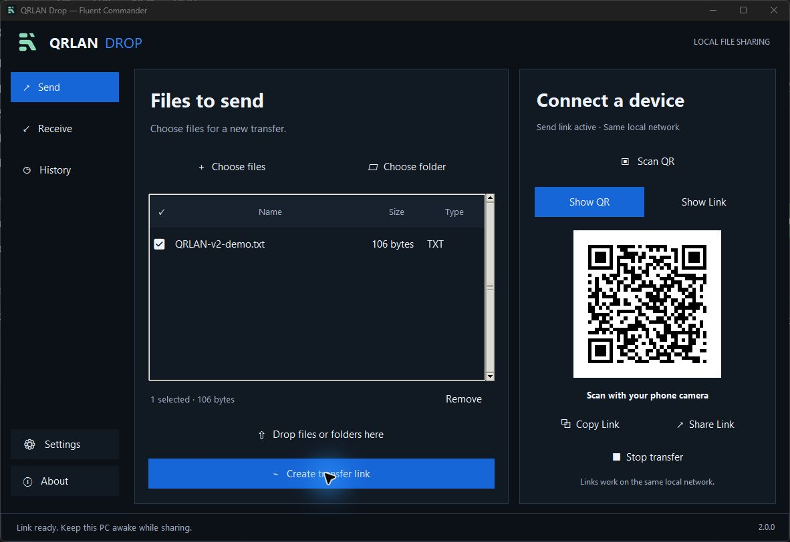
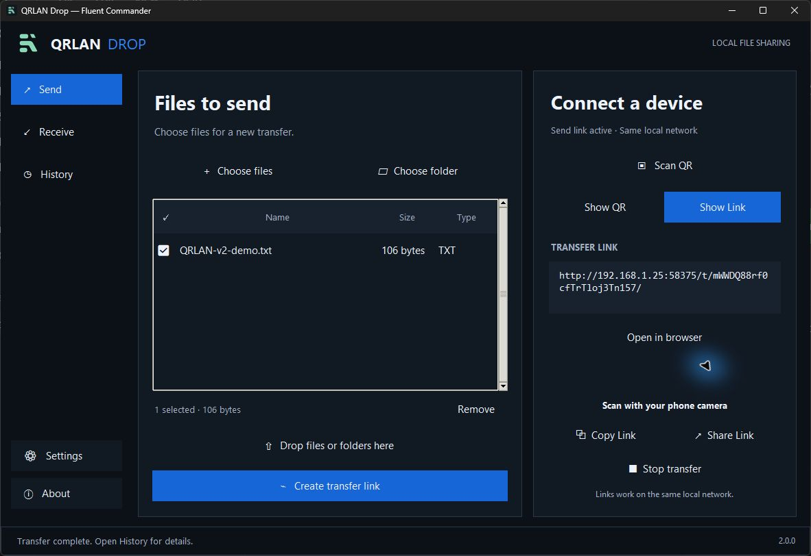
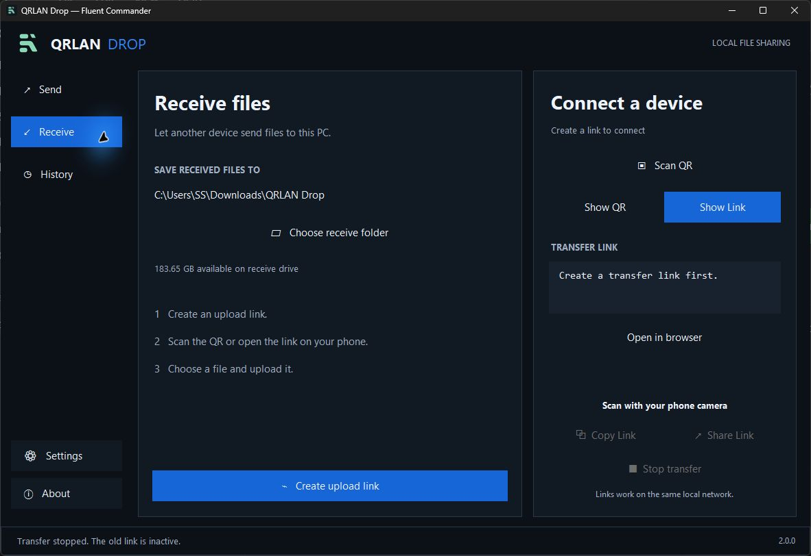
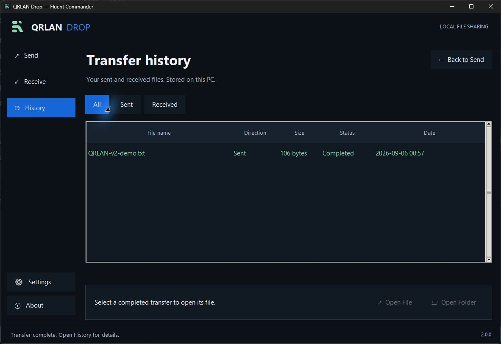

# QRLAN Drop

**Version 2.0.0 — Fluent Commander**


A dark Windows host app for sharing files directly with browsers on your local network. The receiving device needs no app or account.

## Screenshots

<table>
  <tr>
    <td></td>
    <td></td>
  </tr>
  <tr>
    <td></td>
    <td></td>
  </tr>
</table>

## Start the app

Download [QRLAN.Drop.exe](https://github.com/Dhanendra-github/qrlan-drop/releases/download/v2.0.0/QRLAN.Drop.exe) and double-click it. No Python installation is needed. Both devices must be on the same local network; keep the host PC awake and the link active. If Windows Firewall asks, allow Private networks.

The [source ZIP](https://github.com/Dhanendra-github/qrlan-drop/releases/download/v2.0.0/QRLAN.Drop.Source.zip), [release notes](https://github.com/Dhanendra-github/qrlan-drop/releases/tag/v2.0.0), and [patch history](CHANGELOG.md) are also available. To run from source, use `run.ps1` with Python 3.11 or newer installed.

## Send files from this PC

1. Open **Send** and choose files, choose a folder, or drag files/folders into the selection.
2. Tick the files you want to share and click **Create transfer link**.
3. Scan the displayed QR with the other device's camera, or use **Show Link**, **Copy Link**, or **Share Link**.
4. Open the link in the other device's browser and choose a file to download.

Folders add their regular files recursively. Downloads are individual files; folder structure is not recreated and files are not zipped. Changing the selection only affects the next link. Creating a replacement link stops the old link and its active transfers.

## Receive files on this PC

1. Open **Receive** and choose the destination folder.
2. Click **Create upload link**.
3. Scan or share the link to the sending device.
4. Choose a file in that device's browser and upload it. You can repeat this for more files.

Duplicate filenames receive a new name; existing files are not overwritten. Changing the folder preference affects new links. An active link retains its original destination.

## QR and sharing controls

- **Show QR / Show Link:** switch between the QR and readable URL.
- **Copy Link:** copy the current URL to the clipboard.
- **Share Link:** copy the URL, open an email draft, or save the QR as an image. The app does not send messages automatically.
- **Scan QR:** use a camera, import a QR image, or paste a local HTTP/HTTPS link. Review the destination before opening it.
- **Stop transfer:** deactivate the link and cancel active transfers.

Camera scanning requires an available camera and operating-system permission. QR image import works without a camera.

## History

Completed, failed, and cancelled transfer records appear only after opening **History**. Filter by **All**, **Sent**, or **Received**. Select a completed transfer to use **Open File** or **Open Folder**. Opening is disabled if the file has moved or been deleted.

History and receive-folder preferences are stored on this PC under `%LOCALAPPDATA%\QRLAN Drop`. The main screens show pending selections and general progress, without a completed-file feed.

## Large files and network behavior

- The app streams file data and imposes no artificial size cap, including for 1 TB files. Available disk space, browser/device limits, and connection stability still apply. A full 1 TB physical transfer has not been validated in this preview.
- Interrupted transfers must be started again; resumable transfer is not implemented.
- A completed send means the host finished sending the bytes. It cannot verify that the receiving browser saved them to disk.
- Links work while the app runs, on reachable devices on the same network. Guest network isolation or a firewall can block connectivity.
- Anyone with an active link and network access can use it. Links use local HTTP, without cloud storage or Internet tunneling.

## Build and test

Install Python 3.11 or newer and run `build.ps1`. The script creates a virtual environment if needed, installs the pinned requirements, and builds `dist\QRLAN Drop.exe` with the GUI and QR dependencies.

Run automated checks with:

```powershell
.\.venv\Scripts\python.exe -B -m unittest -v
```

Coverage includes streamed transfers, cancellation and cleanup, concurrent duplicate uploads, selected-file downloads, persistent history, URL validation, and QR image decoding.

Keyboard shortcuts: **Ctrl+O** choose files, **Ctrl+H** History, **Ctrl+Enter** create a link. In the file list, **Space** toggles selected rows and **Delete** removes them from the selection.

## License

MIT License. See [LICENSE](LICENSE). Read version history in [CHANGELOG.md](CHANGELOG.md).
